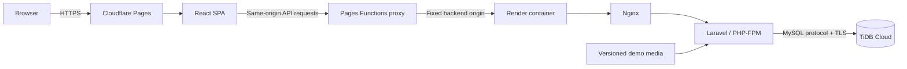

# YaZoo

### Social network and marketplace for the animal ecosystem

YaZoo brings animal owners, communities, breeders, shops, trainers, pet sitters, and veterinarians into one responsive platform. This repository is a full-stack portfolio case study covering product design, frontend engineering, API development, data modeling, security, automated testing, and cloud deployment.

[](https://yazoo-showcase.pages.dev/)
[](https://github.com/5eef/YaZoo/actions/workflows/ci.yml)
[](https://github.com/5eef/YaZoo/actions/workflows/codeql.yml)
[](LICENSE)


## Try the live demo

**Public application:** [https://yazoo-showcase.pages.dev](https://yazoo-showcase.pages.dev/)

The showcase is a real React application connected to a Laravel API and a TLS-secured TiDB Cloud database. Public marketplace pages can be explored without signing in.

### Reviewer account

```text
Email: client.fes@yazoo.test
Password: shared privately with reviewers; never stored in this repository
```

The same private showcase password is used for the seeded professional test accounts. Administrative features and MFA are demonstrated during a supervised review. Cloud database credentials are never used as application login credentials.

<details>
<summary>Role-based demo accounts</summary>

| Demo role | Email |
| --- | --- |
| Client / reviewer | `client.fes@yazoo.test` |
| Breeder | `eleveur.poules.meknes@yazoo.test` |
| Shop | `chats.casablanca@yazoo.test` |
| Pet sitter | `garde.tetouan@yazoo.test` |
| Trainer | `dresseur.chiens.marrakech@yazoo.test` |
| Veterinarian | `veterinaire.agadir@yazoo.test` |

These are fictional portfolio identities. Additional seeded profiles provide content across Moroccan cities.

</details>

> The free Render backend sleeps after inactivity. The first data request can therefore take about one minute; the interface detects this state and reconnects automatically.

### Five-minute portfolio tour

1. Open the public home page and browse animals, products, services, and veterinarians.
2. Sign in as `client.fes@yazoo.test` and scroll through the image-rich social feed.
3. Try reactions, comments, communities, favorites, reservations, conversations, and notifications.
4. Visit professional profiles to compare veterinarian, breeder, shop, trainer, and pet-sitting experiences.
5. Switch the language between French, Arabic, and English, then test mobile view and dark mode.

Health checks: [API liveness](https://yazoo-showcase.onrender.com/health/live) · [database readiness](https://yazoo-showcase.onrender.com/health/ready)

## The product

Animal-related services are often scattered across social networks, classified-ad websites, messaging apps, and appointment tools. YaZoo explores a unified experience where people can discover trusted professionals, publish content, join communities, reserve services, communicate, and review completed transactions.

### Core experiences

| Area | What users can do |
| --- | --- |
| Social feed | Publish posts and stories, display media, comment, react, follow profiles, and receive notifications |
| Communities | Discover public groups, request access to private groups, and manage members with role-aware permissions |
| Marketplace | Browse and manage animals, products, services, and veterinarian listings with search and favorites |
| Reservations | Reserve animals, products, or services and follow status, delivery, invoice, and review workflows |
| Veterinary care | Explore professional profiles, availability slots, appointments, and appointment reviews |
| Messaging | Start direct conversations, track unread state, and contact professionals from contextual entry points |
| Trust and safety | Report content, moderate listings, verify professional profiles, suspend accounts, and audit sensitive actions |
| Internationalization | Use French, Arabic, or English with RTL-aware responsive layouts |

## What this project demonstrates

I built YaZoo as an end-to-end engineering project, not only as a collection of screens. The repository demonstrates:

- component-driven React architecture and responsive, accessible user journeys;
- Laravel REST APIs with validation, authorization policies, and transactional business workflows;
- a relational domain model for social, marketplace, reservation, veterinary, and moderation features;
- secure cookie-based Sanctum authentication, CSRF protection, rate limits, and administrator MFA;
- reusable configuration for email, SMS, payments, queues, realtime events, and media storage;
- automated unit, feature, browser, accessibility, security, and deployment checks;
- containerized delivery with Docker, Nginx, PHP-FPM, GitHub Actions, Cloudflare Pages, Render, and TiDB Cloud.

## Architecture



Cloudflare delivers the static interface immediately. Pages Functions proxy only dynamic routes to the Laravel origin, keeping authentication cookies and CSRF flows same-origin. Render runs the containerized API, while TiDB provides persistent relational data. Versioned showcase media is restored safely when the ephemeral container is replaced.

The full local Docker Compose topology additionally supports MySQL, Redis, a queue worker, a scheduler, and optional Laravel Reverb realtime delivery.

## Technology stack

| Layer | Technologies |
| --- | --- |
| Frontend | React 19, Vite 8, React Router 8, Axios, Tailwind CSS, i18n |
| Backend | PHP 8.4 runtime, Laravel 12, Sanctum, Socialite, REST API |
| Data | MySQL-compatible relational model, TiDB Cloud for the showcase, SQLite for fast tests |
| Infrastructure | Docker, Docker Compose, Nginx, PHP-FPM, Cloudflare Pages, Render, Docker Hub |
| Quality | PHPUnit, Vitest, Playwright, Axe, ESLint, TypeScript, Pint, CodeQL, dependency audits |

## Screenshots

| Home and discovery | Marketplace |
| --- | --- |
|  |  |

The screenshots are versioned in [`docs/screenshots`](docs/screenshots). The live application contains additional authenticated views for the feed, communities, profiles, messaging, reservations, notifications, and administration.

## Quality and verification

The latest recorded showcase verification covered the following layers:

| Check | Result |
| --- | --- |
| Laravel feature and unit tests | 394 tests passed |
| React unit and integration tests | 143 tests passed |
| Playwright browser scenarios | 98 scenarios passed, including accessibility checks |
| Responsive behavior | Mobile, tablet, desktop, LTR/RTL, and light/dark scenarios passed |
| Static quality | ESLint, TypeScript, i18n, Tailwind, legal-placeholder, and Pint checks passed |
| Supply-chain checks | Composer/npm audits, CodeQL, secret scanning, SBOM, and container scanning configured |
| Public deployment | Static pages, deep links, API, CSRF, authentication, database readiness, and 21 demo media files verified |

Run the main checks locally:

```powershell
cd backend
composer install
php artisan optimize:clear
php artisan test
vendor\bin\pint --test
composer audit

cd ..\frontend
npm ci
npm run lint
npm run typecheck
npm run audit:i18n
npm run test -- --run
npm run build
npm run test:e2e
npm audit
```

## Run locally

### Prerequisites

- Git
- Docker Desktop with Docker Compose, or PHP 8.2+, Composer, Node.js 22.22+, npm, and MySQL

### Docker Compose

```powershell
git clone https://github.com/5eef/YaZoo.git
cd YaZoo
Copy-Item .env.example .env
docker compose up -d --build
docker compose exec app php artisan migrate --seed --force
```

Open the frontend on `http://localhost:4173` and the API on `http://localhost:8000`.

The Docker database maps to port `3308`, intentionally keeping it separate from workstation MySQL on `3306` and XAMPP MariaDB on `3307`.

### Without Docker

```powershell
Copy-Item .env.example .env
Copy-Item backend\.env.example backend\.env
Copy-Item frontend\.env.example frontend\.env

cd backend
composer install
php artisan key:generate
php artisan migrate --seed
php artisan serve
```

In a second terminal:

```powershell
cd frontend
npm ci
npm run dev
```

Use only local credentials in `.env` files. Never copy cloud secrets into the repository.

## Demo scope and production readiness

The public showcase runs entirely on free hosting and is designed for safe portfolio review. The codebase includes integration points whose external providers are intentionally not active in the public demo.

| Available in the showcase | Present in the codebase, disabled publicly |
| --- | --- |
| Public catalogs and listing details | CMI payment processing |
| Authentication and seeded role-based accounts | SMS and production email delivery |
| Feed with versioned local images | Persistent visitor file uploads |
| Communities, favorites, reservations, and messaging | Reverb realtime server |
| Reviews, reports, moderation, admin workflows | Dedicated queue workers and scheduler |
| TiDB-backed persistent application data | Production SLA and autoscaling |

Render's free filesystem is ephemeral, so new visitor uploads are disabled instead of pretending they are persistent. A production deployment would connect the existing media abstraction to private and public object storage, enable the required workers, and configure approved payment and communication providers.

See the reproducible zero-cost deployment guide in [`docs/DEMO_DEPLOYMENT_FREE.md`](docs/DEMO_DEPLOYMENT_FREE.md).

## Repository map

```text
YaZoo/
|-- backend/              Laravel API, domain models, migrations, seeders, tests
|-- frontend/             React application, Pages Functions, unit and browser tests
|-- deploy/               Deployment and operational helpers
|-- infra/nginx/          Reverse-proxy configuration
|-- scripts/              CI, auditing, smoke-test, and maintenance scripts
|-- docs/                 Architecture, security, compliance, and operations
|-- .github/workflows/    CI, CodeQL, container publication, and release workflows
|-- docker-compose.yml    Full local multi-service topology
|-- Dockerfile.api-demo   Active portfolio API image
`-- Dockerfile.demo       Single-container fallback showcase
```

## Selected technical documentation

- [Free showcase deployment](docs/DEMO_DEPLOYMENT_FREE.md)
- [Accessibility approach](docs/ACCESSIBILITY.md)
- [End-to-end test plan](docs/E2E_TEST_PLAN.md)
- [Security review](docs/SONAR_SECURITY_REVIEW.md)
- [Payment architecture](docs/PAYMENTS_ARCHITECTURE.md)
- [TiDB compatibility](docs/TIDB_SHOWCASE_COMPATIBILITY.md)
- [Production scaling plan](docs/production-scaling-plan.md)

## Roadmap

- Add durable object storage before enabling public uploads.
- Publish selected API domains as an OpenAPI specification.
- Add privacy-safe production observability and performance dashboards.
- Enable provider-backed email, SMS, and payment integrations in an approved production environment.

## Author

**Youssef Boughioul** — Junior Full-Stack Developer, Morocco

[GitHub @5eef](https://github.com/5eef) · [Email](mailto:bough.youssef@gmail.com)

YaZoo is available under the [MIT License](LICENSE).
